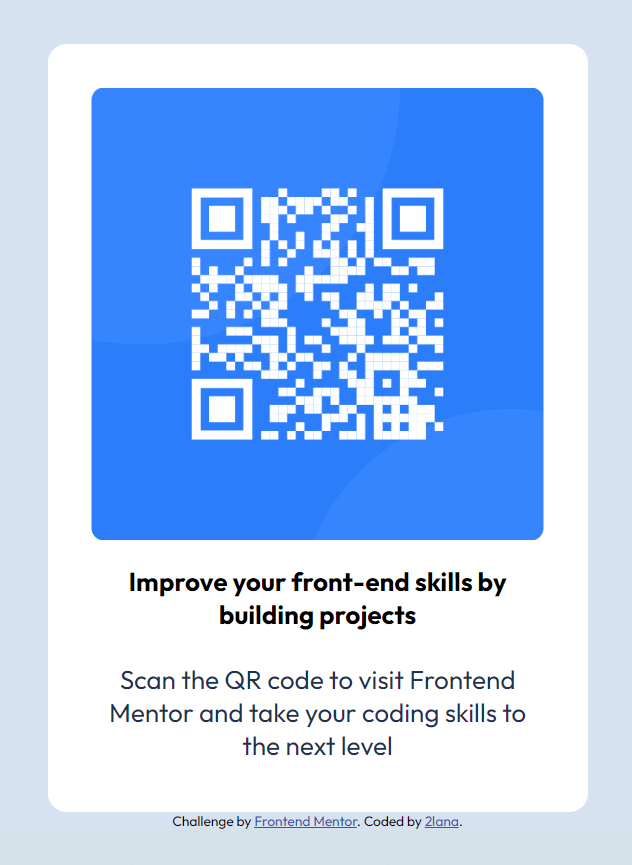

# Frontend Mentor - QR code component solution

This is a solution to the [QR code component challenge on Frontend Mentor](https://www.frontendmentor.io/challenges/qr-code-component-iux_sIO_H). Thanks Frontend Mentor challenges for help me improve my coding skills by building realistic projects. 

## Table of contents

- [Overview](#overview)
  - [Screenshot](#screenshot)
  - [Links](#links)
- [My process](#my-process)
  - [Built with](#built-with)
  - [What I learned](#what-i-learned)
  - [Continued development](#continued-development)
  - [Useful resources](#useful-resources)
- [Author](#author)
- [Acknowledgments](#acknowledgments)


## Overview

### Screenshot



### Links

- Solution URL: [frontendmentor](https://www.frontendmentor.io/profile/2lana)
- Live Site URL: [github](https://github.com/2lana)

## My process

### Built with

- Semantic HTML5 markup
- CSS custom properties
- Flexbox
- Mobile-first workflow

### What I learned

I learned elementary of semantic HTML5 markup, CSS custom properties, flexbox, media queries.


```css
  @media screen and (min-width: 375px) and (max-width: 1339px) {
    /* Targets mobile screens and desktop*/
      .qr-planshe {
    margin: 0 auto; 
    width: 100%;
    }
    .qr-pellet {
    margin-right: 20px;
    margin-left: 20px;
    }
  }

```

### Continued development

I want to continue focusing on in future projects. These could be concepts html, css and Javascript, responsive web design.

### Useful resources

- [slack](https://app.slack.com/) - This is community best practics
- [frontendmentor](https://www.frontendmentor.io/) - This resource gives me the opportunities to learn more about the use frontend and real practice code simple challenges for beginners. Respect!
- [freecodecamp](https://www.freecodecamp.org/) - This recource helped me learn to code
- [developer.mozilla](https://developer.mozilla.org) - This helped me as resourses for developers by developers.
- [w3schools](https://www.w3schools.com/) - This is an amazing resource which helped me better understand html, css. I'd recommend it to anyone still learning technical concept.
- [screen resolution simulator](https://searchenginereports.net/screen-resolution-simulator) - This is an amazing resource which helped me. 
- [Chrome DevTools](https://developer.chrome.com/docs/devtools/console/) - This recource help me testing html and css.
- [W3C](https://validator.w3.org/) - This recource help me checks the markup validity of Web documents in HTML and CSS.
- [docs.github](https://docs.github.com/en/get-started) - This recource helped me try to understand githab for the first time in my life. I created three repositories, two folders and deleted them several times, it’s a nightmare.

Most YouTube channels represent the author’s personal point of view. Only documentation should be examined.

## Author

- Website - [2lana](https://github.com/2lana)
- Frontend Mentor - [@2lana](https://www.frontendmentor.io/profile/2lana)

## Acknowledgments

I thank to anyone who created all the training materials and documentation.

Grateful for reading and reply to every constructive comment.
